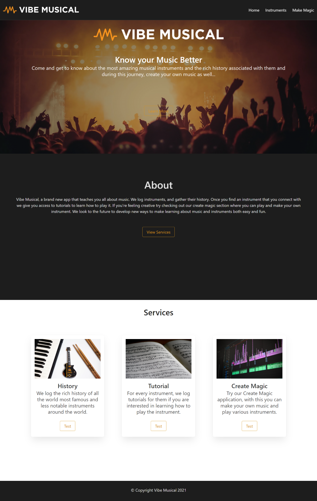
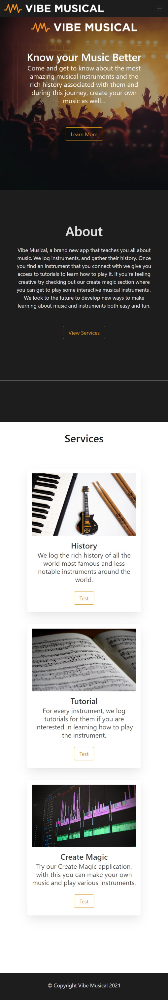
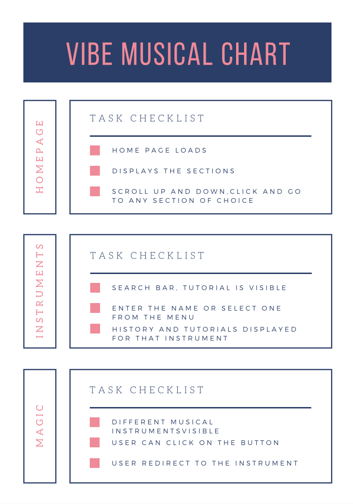

# Vibe Musical - Know your music better!

## Table of Contents
* [Introduction](#introduction)
* [User Story](#story)
* [Design Process](#design)
* [API's and Frameworks used](#api)
* [Installations](#installations)
* [What can the app do?](#details)
* [Credits](#credits)

 ## Introduction 
 Over the last decade or so, the music industry has been experiencing a seismic and possibly irreversible change. With the introduction of modern electronics, it is no longer required to design a new physical instrument.This has made it difficult for people of all ages to know, learn and play any instrument that may be exotic, ancient, belonging to a specific regional or country or for that matter any instrument that they may like! We did our bit by creating an app that not only allows a user of any age to know about any musical instrument that he may be interested in, but also he will be able to go through the history of that instrument and get to know about it in much detail.
Not only this, but the user will be able to learn how to play the searched instrument with the help of a series of video tutorials. And if getting bored you can play some instruments to prop up your mood. 

 The app looks something like this

__DESKTOP VIEW__

__MOBILE VIEW__

## User Story
  * As a user, I want to create a code that will take me to the deployed website.
  * As a user, I should be able to see the home page, along with different sections related to our search.
  * As a user, I can wiki  search about the history of  any global or exotic musical instrument that is found throughout the world.
  * As a user,  I can learn how to play a specific musical instrument using video tutorials.
  * As a user, I can play some interactive instruments, just for fun!

 ## Design Process
   * We used popular web app functionality of searching/clicking an instrument of your choice and displaying information in modals that guide the basic use of our app.
   * We created various iterative processes that helped in testing the functionality of various API’s used for creating the app.
   * We used a framework that was easy-to use to get our project off the ground.
 
 ## API's and Frameworks used
 | YOUTUBE  | WIKISEARCH  | BULMA  | FONTAWESOME 
|---|---|---|--
| Used to search for videos matching specific search terms,topics and instrument.Library used to install it :                                  
You tube Data API V3  | The API allows access to some wiki-features like authentication, page operations, and helps to search the history related  to any global instrument.|An open source framework that provided ready-to-use frontend components that  can easily be combined to build  our responsive web interfaces. | Used to add font icons to your website that works well on any screen size

 ## Installations
   * [The URL of the Github repo](Https://GitHub.com/F34rTh3R34p3r/BCS-Project-1.git)
   * [The URL of the deployed application](Https://f34rth3r34p3r.github.io/BCS-Project-1/)
 
 ## What can the app do?
 Here's a chart off all the functions that our web app is required to do
 
 

    
   
   ## Credits
    The project has been assigned by the Carleton University Coding Bootcamp, our instructor and the TA's
   
     
 
 
 
